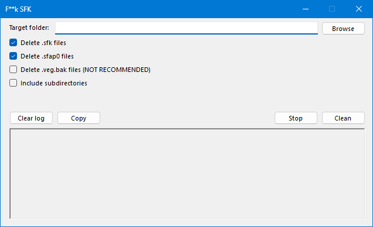

# FrickSfk
A utility that allows you to remove VEGAS' cache files.

*Don't ask why it looks like that*

# Why?
If you've ever used VEGAS Pro, you may have come across these files:
- *.sfk
- *.sfap0

And if you're like me, you might've had a ton of these files, either created by accident (because you imported a .veg as a media item and VEGAS Pro rendered it) or just imported a media file. *It's also a pain in the ass to remove them.*

That's why I created this.

# Will it delete my backups?
Did you check the `Delete .veg.bak files` option? If not, they should be fine.
This only deletes VEGAS' auto-generated backups. Or at least it *should*.

# What does the "Include subdirectories" option do?
It deletes all the selected files in the target directory, and the directories inside it as well.